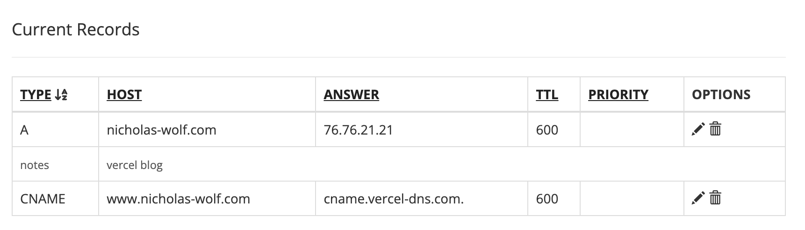

In this post I briefly want to share my initial (experimental) setup on how the blog is working from a technical perspective.

<!-- truncate -->

To blog the first question for myself was: **Do I want to publish on existing blogging websites or hosting my own blog?**

And the answer is that I tried medium once, but I don't like how medium is evolving with all the aggressive paywalls and volatile content quality. Also, I am a big fan of Markdown and portability, so I checked out what other solutions are out there to publish myself.

## Components to host my blog

To host this blog I needed the following components:
1. Blogging Tool / Framework
2. Code / Blog Versioning
3. Hosting Provider
4. Domain Name

### Blogging Tool / Framework

After some research, I found **[Docusaurus](https://docusaurus.io/)** from Meta Open Source. It was mainly build for software / tech documentations but has a very nice blogging support as well!  
They also provide a super helpful comparison with other tools ([link](https://docusaurus.io/docs#comparison-with-other-tools)), if you are interested in other solutions.

### Code / Blog Versioning

My go to is **Git + GitHub** for code versioning, so I use this here as well.

### Hosting Provider

Having all blog code on GitHub, there are now several options on how to publish the blog. Again docusaurus is already providing quite some tutorials on how to publish it ([link](https://docusaurus.io/docs/deployment)).  
Vercel seemed the simplest + generous free tier option, so I went with this option.

The deployment from GitHub to Vercel is straight forward:
1. Add new project
2. Connect GitHub (they call the button Install for any reason) and select the relevant repo
3. Import Repo -> Leave default configs (even though it is saying Docusaurus v2, the version 3 is working as well) -> Deploy
4. See website after a minute :)

As the domain https://blog-six-gamma-72.vercel.app/ is not the easiest to remember, let us connect a domain!

### Domain Name

I checked some reddit threads for getting some experiences about domain name registrars ([link1](https://www.reddit.com/r/sysadmin/comments/101wah8/best_domain_registrars_these_days/), [link2](https://www.reddit.com/r/software/comments/tc9crt/best_place_to_buy_a_domain_name/), [link3](https://www.reddit.com/r/sysadmin/comments/12q4f2n/best_domain_registrar/)).  
Many proposed google domain, which closed their service on Sep 7, 2023 (acquired by Squarespace), so this was not an option anymore.  
I mostly read about these ones:
- https://porkbun.com/
- https://www.cloudflare.com/
- https://www.hover.com/
- https://www.gandi.net/
- https://www.namecheap.com/

If you are looking for privacy, this one sound well: https://njal.la/

Ok long story short: I compared prices for my domain (nicholas-wolf.com) and **porkbun** was the cheapest with ~10$/year, so I went with them.

Now linking my brand new domain to Vercel was also kind of easy:
- In Vercel go to project -> Domains -> add domain (I selected "Add www.nicholas-wolf.com and redirect nicholas-wolf.com to it")
- Then in porkbun:
    - I needed to point the A-record (point to IPv4 address) to the shown Vercel IP
    - For the subdomain www.nicholas-wolf.de, I needed to insert a CNAME record

    See result: 

That's it, Vercel is now taking care of assigning a SSL cert to my domain and after a short waiting time I could see my site under: [https://nicholas-wolf.com](https://nicholas-wolf.com) 🚀